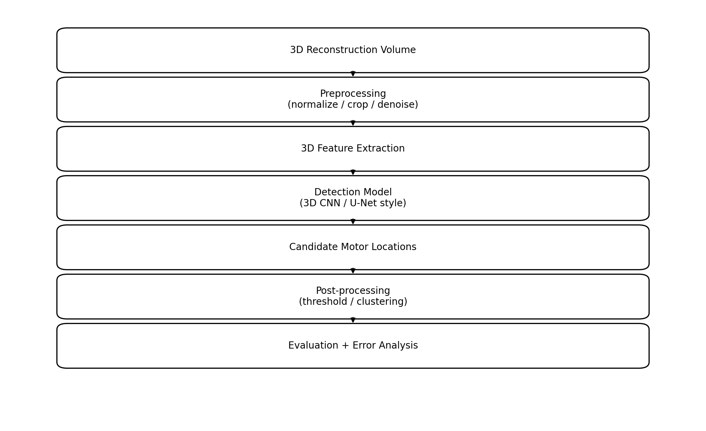
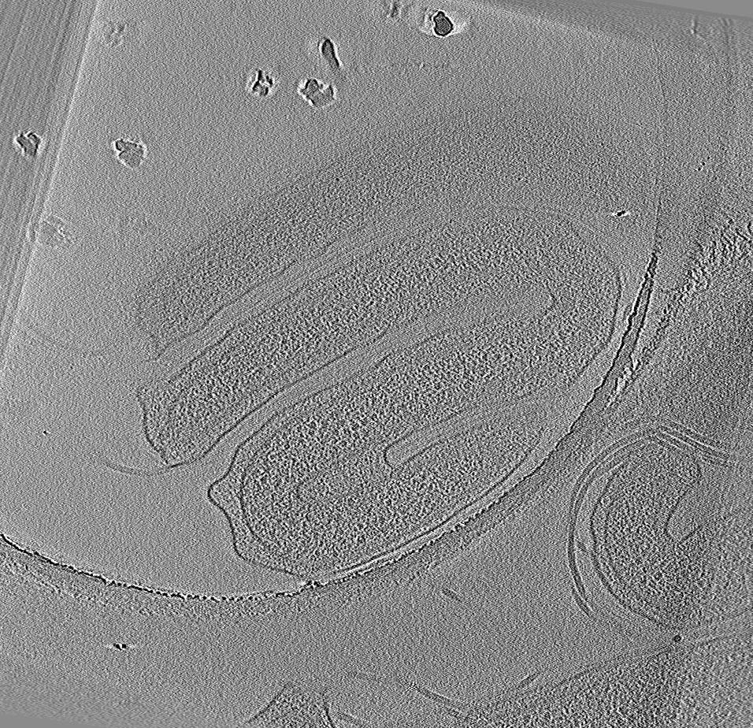
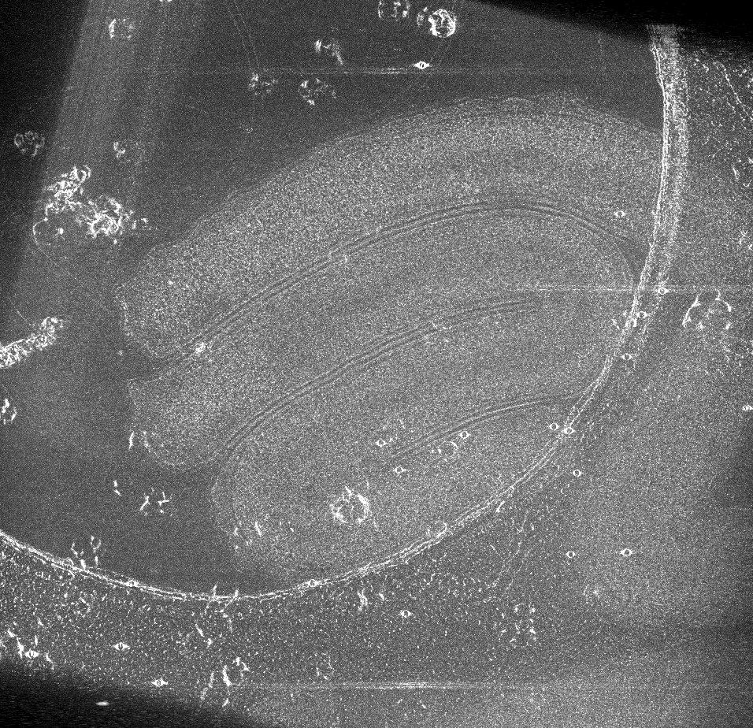

# Locating Bacterial Flagellar Motors

## Scientific Context

Automated detection of biological structures from microscopy data
is essential for scalable analysis in modern microbiology.
Manual annotation is time-consuming and may introduce variability.
This research explores deep learning approaches for identifying
flagellar motor structures within 3D biological reconstructions.

## Biological Significance

Understanding flagellar motor structures supports research in
microbial motility and biological mechanisms. AI-assisted detection
can help scale structural analysis workflows and accelerate
scientific discovery.

## Research Notes
This repository represents ongoing independent research exploration.

Detailed methodology: [docs/methodology.md](docs/methodology.md)

## Research Overview
This repository explores deep learning approaches for automated
identification of biological structures within 3D microscopy
reconstructions.

The research investigates how AI can assist biological
analysis workflows by reducing manual annotation effort.

## Research Motivation
Automated analysis of complex biological imaging data is critical
for scaling scientific discovery. AI-based detection methods
offer opportunities to accelerate structural biology research.

## Research Questions
- Can deep learning reliably detect microscopic structures?
- What features improve detection under noisy conditions?
- How can AI reduce manual analysis workload?

## Approach
Experiments involve preprocessing volumetric data,
training detection models, and evaluating spatial
localization accuracy.

## Limitations
Limited labeled data and imaging noise pose challenges.
Future work may include geometric deep learning approaches.

### Experimental Workflow (Conceptual Overview)

```text
3D Microscopy Data
        ↓
Preprocessing & Volume Normalization
        ↓
Feature Extraction
        ↓
Deep Learning Detection Model
        ↓
Prediction (Motor Location)
        ↓
Evaluation & Analysis
```
### System Overview (Conceptual)


## Dataset Intuition (What the Input Looks Like)

Below are representative visualizations derived from a public benchmark 3D tomogram:
a central slice and a max-intensity projection (MIP). The core challenge is that the
target structure is small relative to the volume and can be difficult to localize
under noise and imaging artifacts.




> Note: This repository does not redistribute datasets or raw tomograms. It includes only derived visualizations.

## Dataset Source & Citation

This work uses publicly available benchmark data hosted on the CryoET Data Portal.
This repository does **not** redistribute raw tomograms or datasets; it includes only
derived visualizations (e.g., a single slice/projection image) generated from the public data.

### Portal citation
If you use the CryoET Data Portal in your work, please cite:
Ermel, U., Cheng, A., Ni, J.X. et al. *A data portal for providing standardized annotations for cryo-electron tomography.*
**Nature Methods** 21, 2200–2202 (2024). https://doi.org/10.1038/s41592-024-02477-2

### Data contributor acknowledgement
Some of the data used in this work was provided through the CryoET Data Portal with the following metadata:

- **Depositing Authors:** Yi-Wei Chang; Grant Jensen  
- **Deposition Name:** *Hylemonella gracilis* (tax_id=887062), strain ATCC 19624 — deposited by Yi-Wei Chang  
- **Deposition ID:** **CZCDP-10048**  
- **Deposition Date:** 2023-10-01  
- **Release Date:** 2023-12-01  
- **Dataset:** *Hylemonella gracilis* (**DS-10161**)  
- **Run:** ycw2012-09-23-41 (**RN-8398**)  
- **Reconstruction Software:** IMOD  
- **Reconstruction Method:** WBP  
- **Voxel Spacing:** 19.733 Å  
- **Volume Size (x, y, z):** (956, 924, 500) px  
- **Alignment Status:** Fiducial aligned = True; CTF corrected = No; Alignment type = GLOBAL (**AL-8477**)

> Note: For the authoritative dataset record and any associated DOIs/publications, refer to the CryoET Data Portal entry for DS-10161 / RN-8398.
